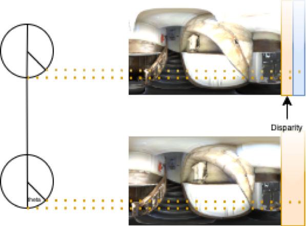
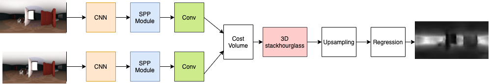
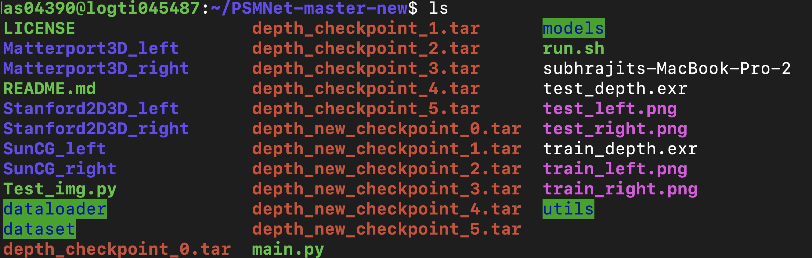

# Project Report for Depth Generation from 360 Stereo Image Pairs using Deep Learning.
In the recent times, there has been a lot of research in the fields of depth estimation and segmentation using deep learning methods from 360 images, but only few have focused on depth estimation from 360 stereoscopic image pairs. Therefore, in this work we propose a 360 stereo image based depth estimation model by using the Pyramid Stereo Matching network (PSMNet). The PSMNet was introduced to generate disparity from 2D horizontal stereo image pairs which is also known as
stereo matching. We use the PSMNet model to train on the 3D60 dataset which contains horizontal stereoscopic Equirectangular Projection (ERP) images and their corresponding depth. The 3D60 dataset contains depth maps as ground truths which contains invalid values because of imperfect scanning and holes emerging during rendering which have been removed using Navier-Stokes image inpainting method. After training the model for 6 epochs we have got average test PSNR of 19 dB and the average PSNR of 14 dB on the validation set.

Estimation of depth or 3D structures from 2D images is known as stereo matching. For this, first we consider the rectified stereo images, then we calculate the disparity which is the horizontal distance between similar pixels on the left and right images. After the calculation of disparity d, we can then calculate depth using the formula (f * B)/d, where f denotes the focal length of the camera and B is known as baseline which is the distance between the left and right cameras.
In the above case, the relation between depth and disparity is valid for 2D projection images, it cannot be used for ERP images. For ERP images, we use the concept of spherical disparity, where the difference in the angle of the representation of the same 3D point is referred to as the disparity shown in the Figure below as ’theta’.
.
Let Z be the depth for a particular pixel, Y be the disparity at that point and b be the baseline length or the distance between the centers of the stereo cameras. Also let us consider that the spherical angle corresponding to this particular pixel is θ. Therefore we have, Z = arcsin (b * sin(θ))/arcsin(Y).

#Proposed Work
In this work we have proposed to use the PSMNet disparity estimation model for generating depth from stereoscopic ERP images. Also the dataset used in this process is 3D60 and the ground truth depth maps of the dataset contain invalid values. In order to remove these invalid values we propose the use
of Navier-Stokes image-inpainting method on the ground truth depth maps of the 3D60 dataset. 
.

# Image inpainting
It has been discussed before that the ground truth depth maps contain holes or invalid values due to rendering issues and so in order to remove these invalid values, we use image inpainitng. Image inpainting is a set of algorithms in computer vision which are used to fill regions in an image or video. In order to
identify the regions to fill in, a binary mask is created where the regions to be filled as the high value is considered as and the rest of the region is denoted as (0). In order to do the filling, the values are taken from the boundaries of the region to be filled. For our work we consider the Navier-Stokes
equations which are used in fluid dynamics, for image inpainting.

 (1) (1) (1).png "File or").
 (1).png "File inp").

# Implementation Details
First downlaod the pre-trained models from the link https://drive.google.com/drive/folders/1zB0nqYtI7ybksKTpzFjDH5ndNGuZSq8N?usp=sharing.
Then arrange the downloaded files as shown below. Also the report for the project can be found in the same link.

'main.py' -> 'main.py' that trains, validates and tests the model and also saves the validation-loss, optimizer-state and model weights as checkpoints for each epoch.

'dataloader/Newdepthloader.py' -> loads the left and right ERP image files along with their corresponding depth map files and groups them into train, validation and test set.

'dataloader/Depthloader.py' -> file uses the train, validation and test filenames from 'Newdepthloader.py' and loads the ERP images and corresponding depth maps for preprocessing.

'Test_img.py' -> uses the saved checkpoints to load the model weights and then predicts the depth map using the pre-trained model for a given pair of stereoscopic ERP images.

'depth_checkpoint_0.tar' -> determines the saved checkpoint after training the model for 1st epoch whcih means epoch 0. The model here is trained without using Image inpainting to remove invalid values from the depth map images. The last part '_0' varies from 0 to 5 meaning that the model is saved as checkpoints from epoch 0 to epoch 5. are saved from epoch 0 to epoch 5.

'depth_new_checkpoint_0.tar' -> determines the saved checkpoint after training the model for 1st epoch whcih means epoch 0. The model here is trained by using Navier-Stokes Image inpainting to remove invalid values from the depth map images. The last part '_0' varies from 0 to 5 meaning that the model is saved as checkpoints from epoch 0 to epoch 5.

Bellow is the list of all files and folders used for implementing the model.
.
For using the code, first download the datasets and then extract them. Then arrange them in folders and put them along with the rest of the code as shown above. Note that only the left, right ERP images and their corresponding depth available in '.exr' format are required.

# Dataset
The link to the dataset is https://vcl3d.github.io/3D60/. In order to access the dataset there is a request form that needs to be filled. After that when we are given permission we can then downlaod the data from Zenodo which is hosting the data https://vcl3d.github.io/3D60/download.html. The dataset is split into three volumes Right, Up and Central (Left-down) viewpoints. For our work we consider Right and Central viewpoints.
# Citation 
As the code for the model is taken from the PSMNet model, then if the code is used for publication purposes please cite the PSMNet paper using the below.
@inproceedings{chang2018pyramid,
  title={Pyramid Stereo Matching Network},
  author={Chang, Jia-Ren and Chen, Yong-Sheng},
  booktitle={Proceedings of the IEEE Conference on Computer Vision and Pattern Recognition},
  pages={5410--5418},
  year={2018}
}

